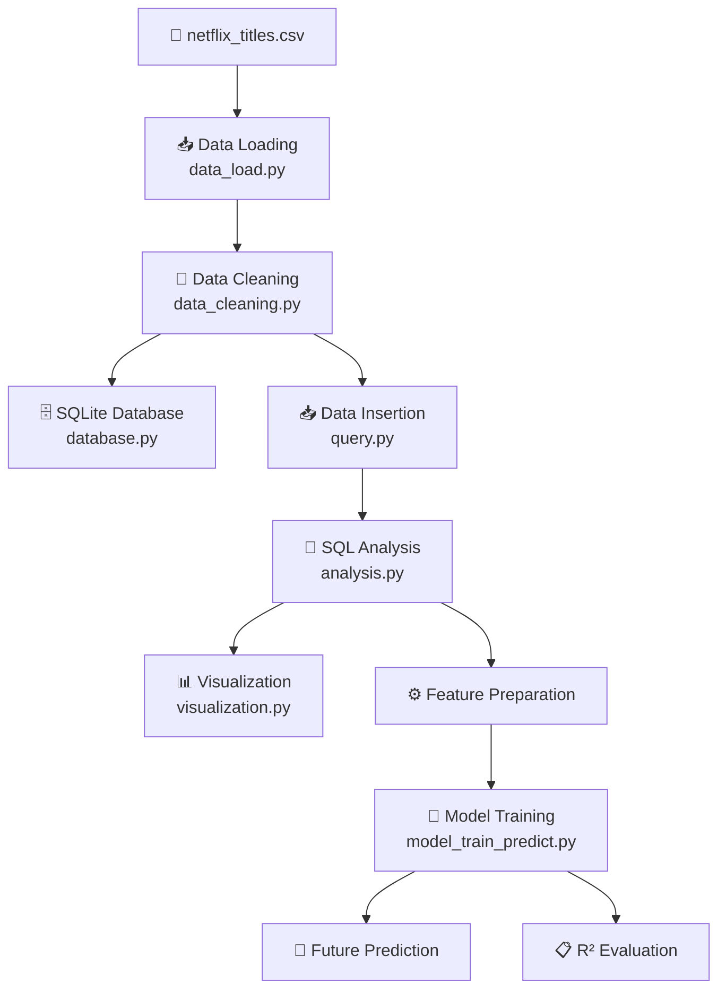

<div align="center">

# 🎬 Netflix Analytics Project

### From Raw Data → SQL Analytics → Visualization → Machine Learning

An end-to-end data analytics pipeline for exploring Netflix content trends and predicting future Movie & TV Show release counts.

---

## 🔗 Navigation

[Overview](#overview) •
[Features](#features) •
[Architecture](#architecture) •
[Screenshots](#screenshots) •
[Setup](#setup) •
[Usage](#usage)

---

## 📑 Table of Contents

* [📖 Overview](#-overview)
* [🎯 Objectives](#-objectives)
* [✨ Features](#-features)
* [🏗️ Architecture](#️-architecture)
* [🛠️ Tech Stack](#️-tech-stack)
* [📂 Project Structure](#-project-structure)
* [🔄 How It Works](#-how-it-works)
* [📊 SQL Analytics](#-sql-analytics)
* [📈 Visualization](#-visualization)
* [🤖 Machine Learning](#-machine-learning)
* [📸 Screenshots](#-screenshots)
* [🚀 Setup](#-setup)
* [▶️ Usage](#️-usage)
* [🖥️ Sample Output](#️-sample-output)
* [🔍 Key Insights](#-key-insights)
* [🔮 Future Improvements](#-future-improvements)
* [👨‍💻 Author](#-author)

---

# 📖 Overview

**Netflix Analytics Project** is an end-to-end data analytics pipeline built using Python, SQLite, SQL, Matplotlib, and scikit-learn.

The project takes the raw **`netflix_titles.csv`** dataset through a complete analytics workflow:

```text
Raw Netflix Dataset
        ↓
   Data Loading
        ↓
   Data Cleaning
        ↓
   SQLite Database
        ↓
    SQL Analysis
        ↓
   Visualization
        ↓
Machine Learning
        ↓
Future Predictions
```

The primary focus is understanding how the number of **Movies** and **TV Shows** has changed over release years and using historical yearly counts to predict future values.

---

# 🎯 Objectives

The project aims to answer three main questions:

### 1. 🎬 How has Netflix content changed over time?

Analyze the number of Movies and TV Shows released across different years.

### 2. 📺 Is Netflix releasing more Movies or TV Shows?

Compare yearly trends between the two content types.

### 3. 🔮 How many titles could be released in a future year?

Use historical release-year counts and machine learning to estimate future Movie and TV Show counts.

---

# ✨ Features

### 🧹 Data Cleaning

* Loads the raw Netflix CSV dataset
* Handles missing values
* Prepares data for analysis
* Standardizes the dataset before database insertion

### 🗄️ SQLite Database

* Creates a SQLite database
* Creates the `netflix_data` table
* Inserts cleaned Netflix records
* Enables SQL-based analytical queries

### 🔎 SQL Analytics

The project performs SQL analysis to determine:

* Total titles per release year
* Movies per release year
* TV Shows per release year
* Content distribution by type

### 📊 Data Visualization

Generates trend graphs showing:

* Movies and TV Shows by year
* TV Show releases by year
* Movie releases by year

### 🤖 Machine Learning

A machine-learning model is trained using historical yearly title counts to predict:

* Future TV Show count
* Future Movie count
* Model R² score

### 🔮 Future Prediction

The user can enter a future year such as:

```text
Enter future year: 2030
```

The trained models then return estimated Movie and TV Show counts.

---

# 🏗️ Architecture

The complete pipeline is structured as follows:



### 🔄 Pipeline Summary

| Stage        | Module                   | Responsibility                           |
| ------------ | ------------------------ | ---------------------------------------- |
| 📥 Load      | `data_load.py`           | Reads the CSV dataset                    |
| 🧹 Clean     | `data_cleaning.py`       | Cleans and preprocesses data             |
| 🗄️ Database | `database.py`            | Creates SQLite database/table            |
| 📥 Insert    | `query.py`               | Inserts cleaned records                  |
| 🔎 Analyze   | `analysis.py`            | Executes SQL queries                     |
| 📊 Visualize | `visualization.py`       | Creates trend graphs                     |
| 🤖 Predict   | `model_train_predict.py` | Trains models and predicts future counts |
| 🚀 Execute   | `main.py`                | Runs the complete pipeline               |

---

# 🛠️ Tech Stack

| Category                 | Technology   |
| ------------------------ | ------------ |
| 🐍 Programming           | Python 3.8+  |
| 🧹 Data Processing       | Pandas       |
| 🔢 Numerical Computing   | NumPy        |
| 🗄️ Database             | SQLite       |
| 🔎 Query Language        | SQL          |
| 📊 Visualization         | Matplotlib   |
| 🤖 Machine Learning      | Scikit-learn |
| 📦 Dependency Management | pip          |
| 🗂️ Version Control      | Git / GitHub |

---

# 📂 Project Structure

```text
netflix-analytics-project/
│
├── 📂 Data/
│   └── netflix_titles.csv
│
├── 📂 database/
│   └── SQLite database files
│
├── 📂 src/
│   ├── database.py
│   ├── data_load.py
│   ├── data_cleaning.py
│   ├── query.py
│   ├── analysis.py
│   ├── visualization.py
│   └── model_train_predict.py
│
├── 🐍 main.py
├── 📋 requirements.txt
├── 🚫 .gitignore
└── 📖 README.md
```

---

# 🔄 How It Works

The entire project is executed through:

```bash
python main.py
```

The pipeline runs in the following order.

### Step 1 — Create Database

The SQLite database and `netflix_data` table are initialized.

### Step 2 — Load Dataset

`data_load.py` loads:

```text
Data/netflix_titles.csv
```

into a Pandas DataFrame.

### Step 3 — Clean Dataset

`data_cleaning.py` handles missing and inconsistent values and prepares the data for downstream processing.

### Step 4 — Insert Data

The cleaned records are inserted into the SQLite database.

### Step 5 — Run SQL Analysis

SQL queries aggregate the number of titles by:

* Release year
* Content type
* Movies
* TV Shows

### Step 6 — Generate Visualizations

Matplotlib creates trend graphs from the SQL results.

### Step 7 — Train ML Models

Historical yearly counts are used as training data.

### Step 8 — Predict Future Values

The user enters a future year and receives predicted Movie and TV Show counts.

### Step 9 — Evaluate Models

The R² score is displayed to indicate how well each model fits the historical data.

---

# 📊 SQL Analytics

One of the core queries used by the project is:

```sql
SELECT
    release_year,
    type,
    COUNT(*) AS total
FROM netflix_data
GROUP BY release_year, type
ORDER BY release_year;
```

This produces yearly counts separated into:

```text
Movie
TV Show
```

Additional queries are used for:

### 📺 TV Shows by Year

```sql
SELECT
    release_year,
    COUNT(*) AS total
FROM netflix_data
WHERE type = 'TV Show'
GROUP BY release_year
ORDER BY release_year;
```

### 🎬 Movies by Year

```sql
SELECT
    release_year,
    COUNT(*) AS total
FROM netflix_data
WHERE type = 'Movie'
GROUP BY release_year
ORDER BY release_year;
```

---

# 📈 Visualization

The SQL results are transformed into visualizations using **Matplotlib**.

The project generates three primary trend analyses:

### 🎬 Movies vs TV Shows

Compares the yearly release trends of both content types.

### 📺 TV Show Trend

Shows the number of TV Shows associated with each release year.

### 🎥 Movie Trend

Shows the number of Movies associated with each release year.

These visualizations make it easier to identify changes and patterns in Netflix's historical catalog.

---

# 🤖 Machine Learning

The machine-learning component uses historical yearly counts to estimate future values.

### Workflow

```text
Historical Netflix Data
        ↓
Yearly Aggregation
        ↓
Movie / TV Show Counts
        ↓
Feature Preparation
        ↓
Model Training
        ↓
Future Year Input
        ↓
Prediction
        ↓
R² Evaluation
```

### Prediction Process

For example:

```text
Enter future year: 2030
```

The model uses historical release-year information to estimate:

```text
Predicted TV Shows → ...
Predicted Movies   → ...
```

Along with:

```text
R² Score → ...
```

> **Note:** The prediction is a model-based estimate derived from historical data. It should not be interpreted as an actual Netflix production forecast.

---

# 📸 Screenshots

Add your generated charts to a `screenshots/` directory:

```text
screenshots/
├── movies_vs_tv_shows.png
├── tv_show_trend.png
├── movie_trend.png
└── prediction_output.png
```

Then embed them here.

## 🎬 Movies vs TV Shows

<p align="center">
  
</p>

---

## 📺 TV Show Trend

<p align="center">
  
</p>

---

## 🎥 Movie Trend

<p align="center">
  
</p>

---

## 🤖 Prediction Output

<p align="center">
  
</p>

> 💡 If the screenshots are not yet available, simply create the folder and add the generated images after running the project.

---

# 🚀 Setup

## Prerequisites

Make sure you have:

* Python **3.8 or higher**
* pip
* Git

---

## 1️⃣ Clone the Repository

```bash
git clone https://github.com/lokeshparuvada/netflix-analytics-project.git
```

Navigate into the project:

```bash
cd netflix-analytics-project
```

---

## 2️⃣ Create a Virtual Environment

### Windows

```bash
python -m venv venv
venv\Scripts\activate
```

### macOS / Linux

```bash
python3 -m venv venv
source venv/bin/activate
```

---

## 3️⃣ Install Dependencies

```bash
pip install -r requirements.txt
```

---

# ▶️ Usage

Run the project from the root directory:

```bash
python main.py
```

The pipeline will:

```text
1. Create the database
2. Load the Netflix dataset
3. Clean the data
4. Insert records into SQLite
5. Execute SQL queries
6. Generate visualizations
7. Train ML models
8. Ask for a future year
9. Predict Movie & TV Show counts
10. Display R² scores
```

When prompted:

```text
Enter future year: 2030
```

---

# 🖥️ Sample Output

```text
========== PREDICTION RESULTS ==========

TV SHOW PREDICTION
Predicted Value: <predicted count>
R2 Score: <score>

MOVIE PREDICTION
Predicted Value: <predicted count>
R2 Score: <score>
```

Replace the placeholders with your actual output after running the model.

---

# 🔍 Key Insights

The analysis can be used to investigate:

### 📅 Release Trends

How the number of Netflix titles changes across release years.

### 🎬 Content Type

Whether Movies or TV Shows represent a larger share of yearly releases.

### 📈 Historical Patterns

Periods where the number of titles increased or decreased.

### 🔮 Future Estimates

Model-based estimates of Movie and TV Show counts for a selected future year.

### 📊 Model Fit

The R² score provides a quantitative measure of how closely the model fits the historical training data.

> **Tip:** Once you run the project, replace this section with your actual numerical findings. Specific numbers make the README considerably stronger for a portfolio.

---

# 🔮 Future Improvements

### 📊 Advanced Analytics

* [ ] Analyze content by country
* [ ] Analyze genres
* [ ] Analyze ratings
* [ ] Analyze directors and cast
* [ ] Add duration analysis

### 🤖 Machine Learning

* [ ] Compare multiple regression models
* [ ] Add train/test evaluation
* [ ] Add cross-validation
* [ ] Compare model performance
* [ ] Add prediction confidence analysis

### 📈 Visualization

* [ ] Interactive Streamlit dashboard
* [ ] Power BI dashboard
* [ ] Tableau dashboard
* [ ] Interactive Plotly charts

### 🧪 Engineering

* [ ] Add unit tests
* [ ] Add logging
* [ ] Add command-line arguments
* [ ] Add configuration files
* [ ] Add automated data validation
* [ ] Add CI/CD workflow with GitHub Actions

### 📚 Documentation

* [ ] Add data dictionary
* [ ] Document database schema
* [ ] Add detailed model documentation
* [ ] Add methodology section

---

# 💼 Skills Demonstrated

This project demonstrates practical experience in:

```text
🐍 Python
   ├── Pandas
   ├── NumPy
   └── Modular Programming

🗄️ SQL
   ├── SQLite
   ├── GROUP BY
   ├── Aggregation
   └── Filtering

📊 Data Analytics
   ├── Data Cleaning
   ├── Transformation
   └── Trend Analysis

📈 Data Visualization
   └── Matplotlib

🤖 Machine Learning
   ├── Feature Preparation
   ├── Model Training
   ├── Prediction
   └── R² Evaluation

🧰 Software Engineering
   ├── Project Structure
   ├── Dependency Management
   └── Git / GitHub
```

---

# 👨‍💻 Author

<div align="center">

## Lokesh Paruvada

### Data Analytics • Python • SQL • Machine Learning

<br>

<a href="https://github.com/lokeshparuvada">
  
</a>

</div>

---

# ⭐ Support

If you found this project useful:

⭐ **Star the repository**

🍴 **Fork the project**

💡 **Share feedback or suggestions**

---

<div align="center">

### 🎬 Netflix Analytics Project

**Raw Data → Clean Data → SQL → Visualization → Machine Learning → Prediction**

<br>

*Built with Python, SQL, and Machine Learning.*

</div>
